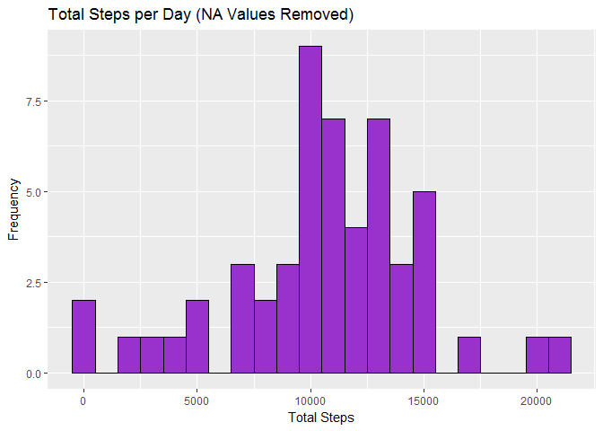
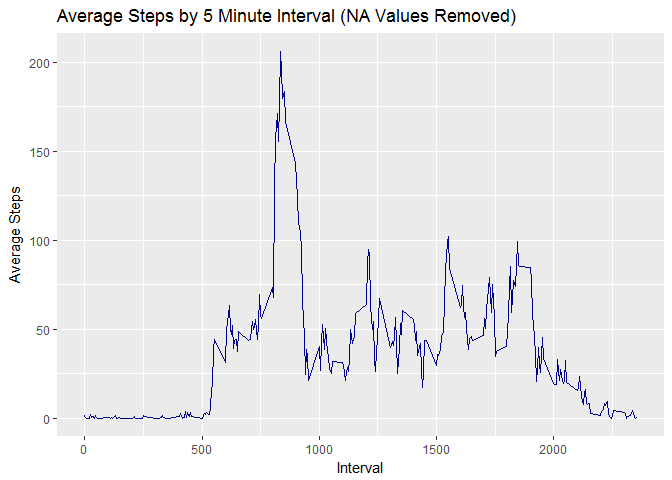
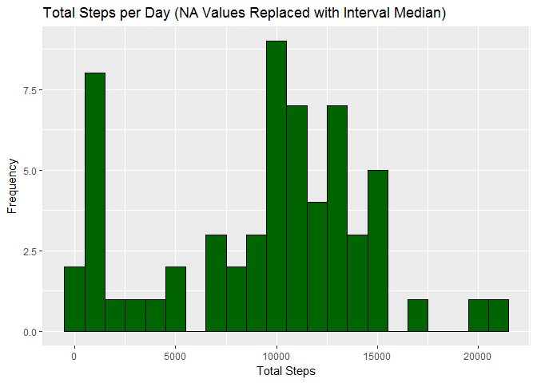
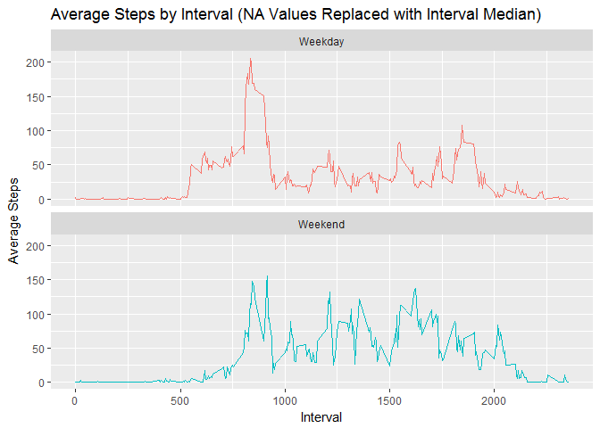

# Reproducible Research: Peer Assessment 1


# Loading and preprocessing the data

### Load packages


```r
library(dplyr)
library(ggplot2)
library(knitr)
library(RColorBrewer)
```

### Load the data

NOTE: It is assumed that you have already downloaded the activity.csv and saved it in your working directory.


```r
ActivityData <- read.csv("activity.csv", header = TRUE)
ActivityData$date <- as.POSIXct(ActivityData$date, format="%Y-%m-%d")
```

### Transform the data for analysis


```r
ActivityData <- ActivityData %>%
        mutate(dayofweek = weekdays(date)) %>%
        mutate(daytype = ifelse(dayofweek %in% c("Saturday", "Sunday"), "Weekend", "Weekday"))
```

# What is mean total number of steps taken per day?


```r
StepsPerDay <- ActivityData %>%
        na.omit() %>%
        select(date, steps) %>%
        group_by(date) %>%
        summarize(TotalSteps = sum(steps))
        
g1 <- ggplot(data = StepsPerDay, aes(x = TotalSteps)) 
g1 + geom_histogram(color = "Black", fill = "DarkOrchid", binwidth = 1000) +
        ggtitle("Total Steps per Day (NA Values Removed)") +
        labs(x = "Total Steps",
             y = "Frequency") 
```



### What are the mean and median steps per day?


```r
mean(StepsPerDay$TotalSteps)
```

```
## [1] 10766.19
```

```r
median(StepsPerDay$TotalSteps)
```

```
## [1] 10765
```


# What is the average daily activity pattern?


```r
DailyPattern <- ActivityData %>%
        na.omit() %>%
        select(interval, steps) %>%
        group_by(interval) %>%
        summarize(AverageSteps = mean(steps))
        
g2 <- ggplot(DailyPattern, aes(x = interval, y = AverageSteps)) 
g2 + geom_line(color = "DarkBlue") +
        ggtitle("Average Steps by 5 Minute Interval (NA Values Removed)") +
        labs(x = "Interval",
             y = "Average Steps") 
```


   
### Which 5-minute interval, on average across all the days in the dataset, contains the maximum number of steps?  


```r
DailyPattern %>%
        filter(AverageSteps == max(AverageSteps))
```

```
## # A tibble: 1 × 2
##   interval AverageSteps
##      <int>        <dbl>
## 1      835     206.1698
```
        

# Imputing missing values

### What is the total number of missing values in the dataset?


```r
sum(is.na(ActivityData$steps))
```

```
## [1] 2304
```

### Impute missing values with interval median


```r
NAReplaceActivityData <- ActivityData %>% 
        group_by(interval) %>%
        mutate(steps = replace(steps, is.na(steps), median(steps, na.rm=TRUE)))
```

### Total number of steps taken per day with missing values replaced


```r
NAReplaceStepsPerDay <- NAReplaceActivityData %>%
        ungroup(interval) %>%
        select(date, steps) %>%
        group_by(date) %>%
        summarize(TotalSteps = sum(steps))
        
g3 <- ggplot(data = NAReplaceStepsPerDay, aes(x = TotalSteps)) 
g3 + geom_histogram(color = "Black", fill = "DarkGreen", binwidth = 1000) +
        ggtitle("Total Steps per Day (NA Values Replaced with Interval Median)") +
        labs(x = "Total Steps",
             y = "Frequency") 
```



### Calculate and report the mean and median total number of steps taken per day


```r
mean(NAReplaceStepsPerDay$TotalSteps)
```

```
## [1] 9503.869
```

```r
median(NAReplaceStepsPerDay$TotalSteps)             
```

```
## [1] 10395
```
      
### Do these values differ from the estimates from the first part of the assignment? 
Yes.

### What is the impact of imputing missing data on the estimates of the total daily number of steps?  
By replacing the missing values with the median for the specified interval, the total mean and median are much lower.

# Are there differences in activity patterns between weekdays and weekends?


```r
DailyPatternWkd <- NAReplaceActivityData %>%
        ungroup(interval) %>%
        select(daytype, interval, steps) %>%
        group_by(daytype, interval) %>%
        summarize(AverageSteps = mean(steps))
        
g4 <- ggplot(DailyPatternWkd, aes(x = interval, y = AverageSteps, color = daytype)) 
g4 + geom_line() +
        facet_wrap(~daytype, nrow = 2) +
        ggtitle("Average Steps by Interval (NA Values Replaced with Interval Median)") +
        labs(x = "Interval",
             y = "Average Steps")  +
        theme(legend.position = "none")
```


          
             
             

